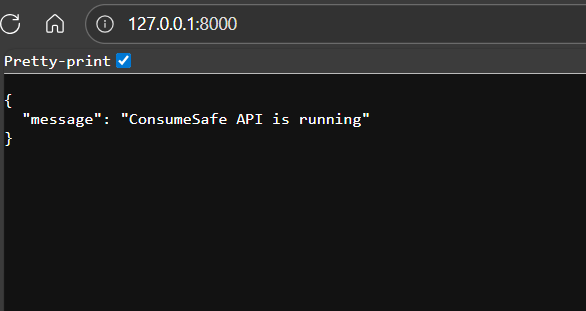
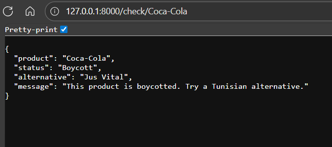
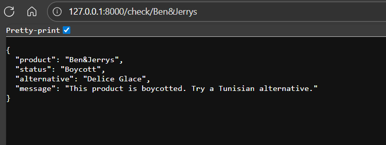
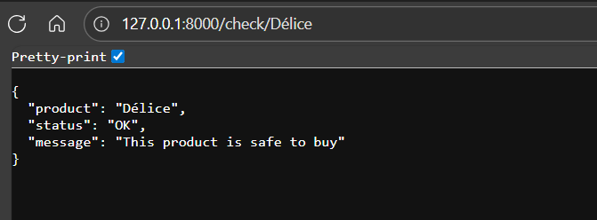
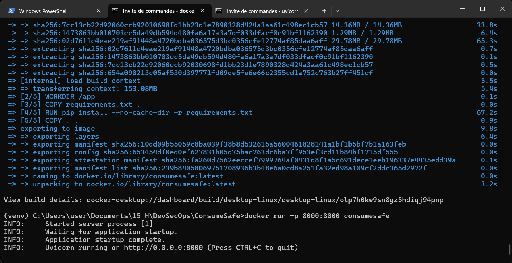
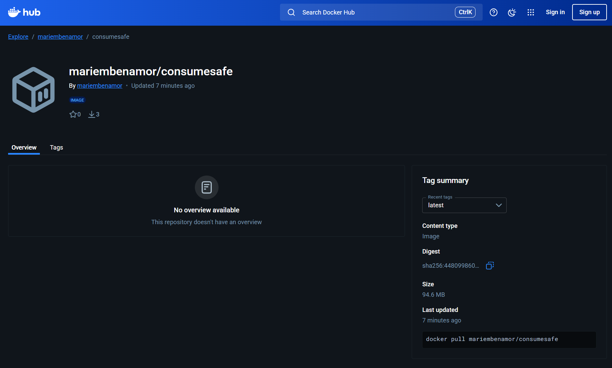
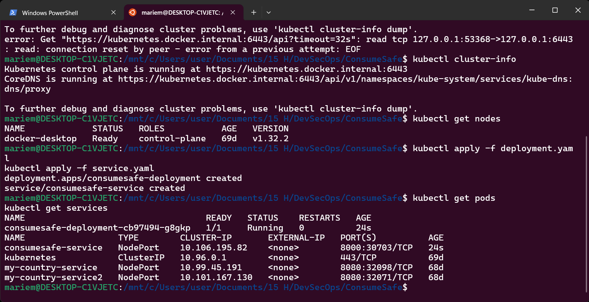
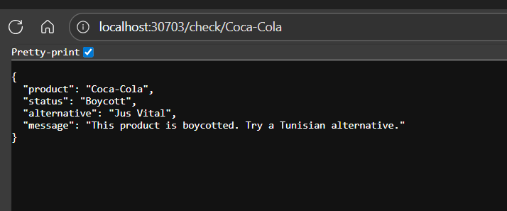
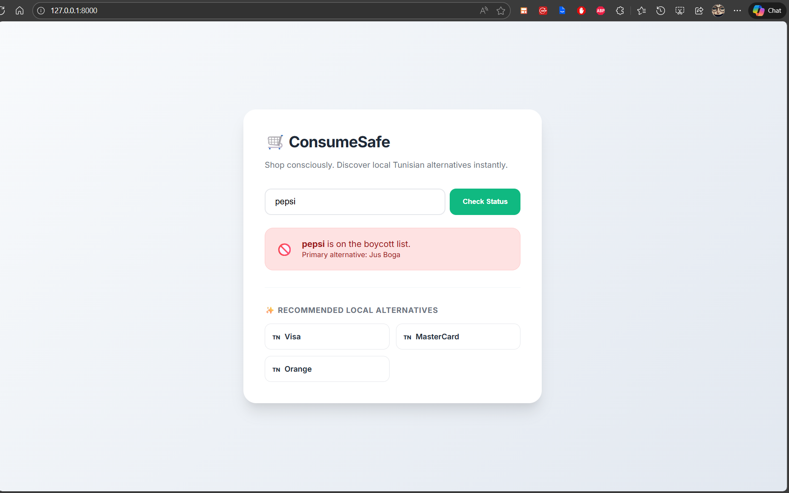
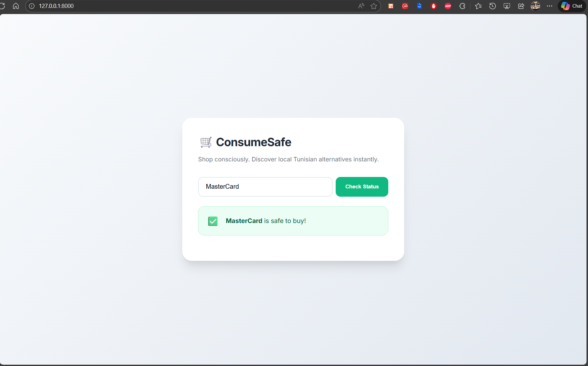

# Project: ConsumeSafe Application

## Table of Contents
1. [Objective](#objective)
2. [Key Features](#key-features)
3. [Tech Stack](#tech-stack)
4. [Step 1: Backend + Core Functionality](#step-1-backend--core-functionality)
5. [Step 2: Dockerization + Kubernetes Deployment](#step-2-dockerization--kubernetes-deployment)
6. [Step 3: CI/CD + Security Hardening + Optional AI](#step-3-cicd--security-hardening--optional-ai)
7. [Step 4: Web Frontend & User Interface](#step-4-web-frontend--user-interface--add-a-simple-web-frontend-that-makes-consumesafe-platform-visible)


## Objective:
Build an application to help users make safer consumption choices by checking if products are on a boycott list.
## Key Features:
* Product Check: User inputs a product, app checks if it’s on a boycott list.
* Suggestions: If the product is boycotted, highlight it and suggest alternative Tunisian products.
## Tech Stack:
* Backend: Python (for APIs and logic)
* Version Control: Git
* Containerization: Docker image for deployment
* Orchestration: Kubernetes (k8s) cluster deployment
* CI/CD: Any Continuous Integration server of your choice (e.g., GitHub Actions, GitLab CI, Jenkins)
* Security: Harden the application and infrastructure
* AI Integration: Optional; can be used to improve product recommendations or automate boycott list updates
## Deliverables:
* Working application deployed in Kubernetes
* Dockerized microservices (if applicable)
* Secure pipelines and deployment
* Optional AI features for smarter recommendations

### Step 1: Backend + Core Functionality : Have a working API to check boycott products and suggest alternatives.
1. Create the Github repository named ConsumeSafe then Clone it on PC
```
cd C:\Users\user\Documents\15 H\DevSecOps
git clone https://github.com/Mariem-9/ConsumeSafe.git
cd ConsumeSafe
```
2. Create Python Virtual Environment
```
python -m venv venv                     # Isolates project dependencies
venv\Scripts\activate                   # Activate it
```
3. Install backend dependencies
```
pip install fastapi uvicorn pandas      # For FastAPI (modern, fast, perfect for DevOps & k8s)
pip freeze > requirements.txt           # Saved in requirements.txt 
```
4. Create boycott_list.csv with 100 products and mixed statuses (Boycott / Ok) and Tunisian alternatives where needed.
5. Create FastAPI backend (app.py)
6. Run the backend locally 
```
uvicorn app:app --reload                # Venv must be Activated 
```
Open:
```
http://127.0.0.1:8000

```
Then test : 
```
http://127.0.0.1:8000/check/Coca-Cola
http://127.0.0.1:8000/check/Ben&Jerrys
http://127.0.0.1:8000/check/Délice
```
7. Commit to Github
```
git add .
git commit -m "Step 1: FastAPI backend with boycott check"
git push
```
#### Project structure
```
ConsumeSafe/
│
├── app.py
├── boycott_list.csv
├── requirements.txt
├── screenshots/
└── venv/
```
#### Screenshot of API Response







> Python backend running locally, checking products against boycott list. 

### Step 2: Dockerization + Kubernetes Deployment : Containerize the app and deploy it.
1. Dockerize the FastAPI app : create a Dockerfile
2. Build and run Docker image
```
docker build -t consumesafe .
docker run -p 8000:8000 consumesafe
```
Open:
```
http://127.0.0.1:8000/check/Coca-Cola

```


3. Push to Docker Hub : 
Open WSL:
```
cd /mnt/c/Users/user/Documents/15\ H/DevSecOps/ConsumeSafe <--
```
```
docker login                                                   # Log in to Docker Hub from terminal <--
docker tag consumesafe mariembenamor/consumesafe:latest        # Tag local image
docker push mariembenamor/consumesafe:latest                   # Push the image to Docker Hub
docker run -p 8000:8000 mariembenamor/consumesafe:latest       # docker run -p 8000:8000 mariembenamor/consumesafe:latest <--
```
Go to: https://hub.docker.com/r/mariembenamor/consumesafe 


4. Prepare Kubernetes deployment : create 2 YAML files: Deployment + Service
5. Deploy to Kubernetes
```
kubectl cluster-info
kubectl get nodes
kubectl apply -f deployment.yaml
kubectl apply -f service.yaml
kubectl get pods
kubectl get services
```
Open:
```
http://localhost:30703/check/Coca-Cola

```



6. Commit to Github
```
git add .
git commit -m "Step 2: Dockerized FastAPI, Kubernetes deployment and service YAMLs"
git push
```
#### Project structure
```
ConsumeSafe/
│
├── app.py
├── boycott_list.csv
├── requirements.txt
├── screenshots/
├── Dockerfile
├── deployment.yaml
├── service.yaml
└── venv/
```
🚨Docker Stuck in Starting Mode : https://youtu.be/dYiPms0xnIE?si=VXQ1LWYP2FsgFSue 

> Backend running in Docker and Kubernetes, accessible for testing.

### Step 3: CI/CD + Security Hardening + AI : Automate deployment, secure the app, and add AI for recommendations.
1. Security Hardening
```
docker scout quickview mariembenamor/consumesafe:latest
```
Scan Results Summary : 
* Total vulnerabilities: 22 in 11 packages
* Severity:
    * 0 Critical ✅
    * 0 High ✅
    * 2 Medium ⚠️
    * 20 Low (mostly older libraries)
* Medium CVEs to note:
    * tar 1.35+dfsg-3.1 → CVE-2025-45582
    * pip 24.0 → CVE-2025-8869 (fix in pip 25.3)
* Base image: python:3.11-slim
* Scout recommendation: Upgrade to python:3.12-slim for latest patches
* Most of the Low CVEs are in Debian packages (glibc, coreutils, openssl, etc.) — usually acceptable for DevSecOps demo projects

Recommended Security Hardening Steps : 
* Update your Dockerfile to install the latest pip
* Upgrade base image

Rebuild and push hardened image : 
```
docker build -t mariembenamor/consumesafe:latest .
docker push mariembenamor/consumesafe:latest
```
The final image contains:
* 0 Critical
* 0 High
* 1 Medium (Debian tar – no fix available upstream)
* Low CVEs are accepted as OS-level risks
2.  CI/CD : GitHub Actions : Create .github/workflows/ci-cd.yaml
```
cd "/mnt/c/Users/user/Documents/15 H/DevSecOps/ConsumeSafe"
mkdir -p .github/workflows
nano .github/workflows/ci-cd.yml
```
Create Docker Hub Access Token : Docker Hub → Profile → Account Settings → Security → New Access Token → Name: github-actions → Permissions: Read, Write
Add secrets in GitHub : GitHub repository → Settings → Secrets and variables → Actions → New repository secret → Add:
Name	           Value
DOCKER_USERNAME	  mariembenamor
DOCKER_PASSWORD	  (paste token here)

 Commit to Github
```
git add .
git commit -m "To test: CI/CD : GitHub Actions : Create .github/workflows/ci-cd.yaml"
git push
```
This pipeline does full DevSecOps automation:
* Push code → triggers workflow
* Build a Docker image
* Scan it for vulnerabilities
* Push it to Docker Hub

3. AI feature : Simple recommendation improvement:
If a user’s product is on the boycott list:
* Highlight it
* Suggest alternative Tunisian products
The recommendation feature compares the product name you enter to all other product names using text similarity. It then returns the top 3 most similar products, excluding the one you typed
🚨 Update requirements.txt to include: scikit-learn>=1.5.0
🚨 Update Dockerfile to install new dependencies:
```
# Install dependencies
RUN pip install --no-cache-dir -r requirements.txt
docker build -t mariembenamor/consumesafe:latest .
```
Or Test locally (outside Docker): 
```
pip install --no-cache-dir -r requirements.txt
venv\Scripts\activate
pip install scikit-learn
pip freeze > requirements.txt
uvicorn app:app --reload 
```
Open:
```
http://127.0.0.1:8000/recommend?product_name=Pepsi
http://127.0.0.1:8000/recommend?product_name=Apple
```
✨ For ConsumeSafe project, the current recommendation method is very basic. It only looks at text similarity between product names, which means:
* It doesn’t consider availability, popularity, or category.
* “Coca-Cola” might get “Pepsi” just because the letters are similar — which is fine, but for local alternatives, it might miss “Jus Vital” unless the name is close.
* For boycotted products, it doesn’t prioritize safe Tunisian alternatives automatically.
💡Better approach : Add a category column so recommendations first suggest the official alternative, then other products from the same category, making them relevant and safe.
4. Commit to Github
```
git add .
git commit -m "Step 3: CI/CD + Security Hardening + AI "
git push
```
> Full project ready, optionally CI/CD + AI, secure and deployed.

### Step 4: Web Frontend & User Interface : add a simple web frontend that makes ConsumeSafe platform visible
To move beyond a simple API, a modern user interface was built to provide a better user experience.
UI/UX Improvements: Implemented a clean "Inter" font-based design.
* Added Dynamic Cards: Red for Boycott (🚫), Green for Safe (✅).
* Loading States: Integrated a CSS spinner for real-time feedback during AI processing.
* Responsive Grid: Alternatives are displayed in a clean, hover-animated grid.
#### Project structure
```
ConsumeSafe/
│
├── app.py
├── boycott_list.csv
├── requirements.txt
├── screenshots/
├── static/
│    └── style.css
├── templates/
│    └── index.html
├── Dockerfile
├── deployment.yaml
├── service.yaml
└── venv/
```
```
cd C:\Users\user\Documents\15 H\DevSecOps
cd ConsumeSafe
venv\Scripts\activate
pip install jinja2
pip freeze > requirements.txt
uvicorn app:app --reload
```
Open:
```
http://127.0.0.1:8000/
```


🚨Since we added frontend files (templates/ and static/), we must also copy them into the Docker image.

Next : Commit to Github
```
git add .
git commit -m "Step 4: Web Frontend & User Interface "
git push
```